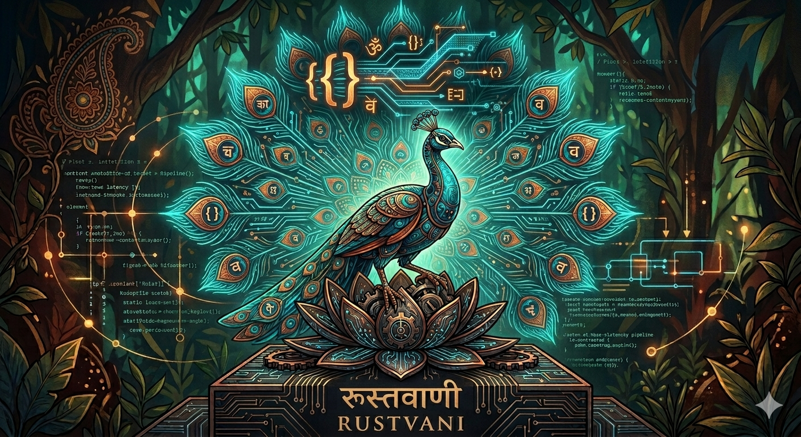

<p align="center">
  
</p>

# rustvani — वाणी

**High-performance voice agent pipeline framework in Rust.** A from-scratch port of [Pipecat](https://github.com/pipecat-ai/pipecat) designed for production voice AI deployments where latency, memory, and concurrency matter.

> *vānī* (वाणी) — voice, speech, language

```
User speaks → VAD → STT → LLM → TTS → User hears
              500ms   ~     ~     ~      ← end-to-end, not minutes
```

---

## Why rustvani?

If you've built voice agents with Pipecat (Python), you know the architecture is excellent — frame-based pipelines, clean processor abstractions, interrupt handling. But Python's async runtime, GIL contention, and memory overhead become real problems at scale.

rustvani keeps Pipecat's architecture and fixes the runtime:

| | Pipecat (Python) | rustvani (Rust) |
|---|---|---|
| Runtime | asyncio + threads | Tokio (work-stealing, zero-cost futures) |
| VAD inference | Blocks event loop or GIL-bound thread | `spawn_blocking` on true OS threads |
| Memory per session | ~80–150 MB | ~8–15 MB |
| Frame dispatch | Dynamic dict lookups, vtable overhead | Monomorphized generics, enum dispatch |
| Cold start | 2–5s (interpreter + imports) | <100ms (static binary) |
| Deployment | Docker + Python env | Single static binary, ~15 MB |

This isn't a wrapper or binding — it's a ground-up Rust implementation that mirrors Pipecat's mental model so you can reason about both codebases interchangeably.

---

## Architecture

```
┌──────────────────────────────────────────────────────────────────┐
│  PipelineTask                                                    │
│                                                                  │
│  [TaskSource] → Transport.Input → VAD → STT → UserAgg →        │
│                 LLM → AssistantAgg → TTS → Transport.Output →   │
│                 [TaskSink]                                       │
│                                                                  │
│  Upstream  ◄────────────────────────────────────────────────     │
│  Downstream ────────────────────────────────────────────────►    │
└──────────────────────────────────────────────────────────────────┘
```

### Core concepts (1:1 with Pipecat)

**Frames** — Typed messages that flow through the pipeline. Three categories: System (lifecycle, VAD signals, audio input), Control (end, LLM response boundaries), and Data (transcriptions, LLM text, audio output, function calls). Every frame has a unique ID and optional sibling ID for broadcast deduplication.

**FrameProcessor** — The universal building block. Every component (VAD, STT, LLM, TTS, transport, pipeline itself) is a `FrameProcessor`. Each has two async queues: an input queue (system frames get priority) and a process queue (data/control frames). This two-queue design ensures lifecycle frames like `InterruptionFrame` are never blocked behind a backlog of audio chunks.

**Pipeline** — Chains processors into a linked list with source/sink sentinels. A Pipeline IS a FrameProcessor, so pipelines nest inside pipelines.

**PipelineTask** — Lifecycle wrapper. Manages setup, StartFrame injection, heartbeats, idle timeout, and graceful shutdown. Exposes callback hooks (`on_pipeline_started`, `on_pipeline_finished`, `on_idle_timeout`) and a `push_sender()` for external frame injection from your transport.

### Where rustvani diverges from Pipecat

**Enum-based frames instead of class hierarchy.** Python uses inheritance (`class TranscriptionFrame(DataFrame)`). Rust uses `Frame { inner: FrameInner }` where `FrameInner` is a three-level enum (`System | Control | Data`). Pattern matching replaces `isinstance()` checks — the compiler enforces exhaustiveness.

**Monomorphized adapters.** The `LLMAdapter` trait is used as a generic bound (`struct Handler<A: LLMAdapter>`), not a trait object. The compiler generates specialized code per provider — no vtable indirection on the hot path.

**`Arc<Mutex<>>` for model state.** Silero VAD and Piper TTS models need `&mut self` for `session.run()`. They're wrapped in `Arc<Mutex<SileroVadInner>>` so multiple pipeline instances can share model weights without duplicating them in memory. The mutex is held only during the blocking inference call inside `spawn_blocking`.

**Direct mode processors.** Source/sink sentinels skip the input/process task loops entirely (`enable_direct_mode: true`). Frames are processed inline — no queue overhead for infrastructure processors that just route.

---

## Modules

```
src/
├── adapters/          LLM provider adapters (OpenAI wire format)
│   └── schemas/       Provider-agnostic tool/function schemas
├── audio_process/     Noise suppression (RNNoise) + resampling (rubato)
├── context/           Shared LLMContext (messages, tools, tool_choice)
├── dhara/             Conversation flow engine (node-based state machine)
├── frames/            Frame types, FrameProcessor, priority queues
├── pipeline/          Pipeline assembly + PipelineTask lifecycle
├── processors/        LLM user/assistant aggregators
├── ravi/              RAVI protocol (real-time audio/video interface)
├── services/
│   ├── llm/           OpenAI + Sarvam LLM (SSE streaming, function calling)
│   ├── stt/           Sarvam STT (WebSocket streaming)
│   └── tts/           Sarvam TTS (WebSocket) + Piper TTS (local ONNX)
├── tools/             Built-in tools (Neon Postgres with pgvector)
├── transport/         WebSocket transport (axum) + base I/O
├── utils/             Sentence splitter, text preprocessor
└── vad/               Silero VAD (ONNX) + state machine
```

---

## Features

### Voice Activity Detection
- **Silero VAD** via ONNX Runtime (`ort` crate) — same model as Pipecat
- 4-state machine: `Quiet → Starting → Speaking → Stopping → Quiet`
- Configurable confidence threshold, start/stop durations, minimum volume
- Volume calculation using dBFS approximation of EBU R128
- Inference on `spawn_blocking` — never blocks the Tokio executor

### Speech-to-Text
- **Sarvam AI** streaming WebSocket STT (`saaras:v3`)
- Supports transcription, translation, verbatim, transliteration, and codemix modes
- Multi-language: `ml-IN`, `hi-IN`, `en-IN`, auto-detect (`unknown`)
- Integrated **RNNoise** noise suppression (pure Rust via `nnnoiseless`)
- Transparent resampling if source rate ≠ 48 kHz (via `rubato`)

### Large Language Models
- **OpenAI-compatible** API with SSE streaming
- **Sarvam LLM** (`sarvam-m`, `sarvam-30b`) with optional CoT thinking mode
- Full function calling with re-invocation loop (model calls tool → execute → re-invoke)
- Configurable max tool rounds to prevent infinite loops
- Provider adapter system — add new providers by implementing `LLMAdapter`

### Text-to-Speech
- **Sarvam Bulbul** TTS (v2, v3-beta, v3) — WebSocket streaming with 25+ voices
- **Piper TTS** — fully local ONNX inference, zero network calls
  - espeak-ng phonemization → Piper ONNX → chunked PCM streaming
  - Multiple quality levels (Low/Medium/High) with different latency/quality tradeoffs
  - Shared model across pipeline instances via `Arc<Mutex<PiperModel>>`
- Sentence-aware text buffering with abbreviation detection (Mr., Dr., IPC., etc.)
- Indian numbering system preprocessing for TTS (10000 → 10,000)

### Function Calling & Tools
- **FunctionRegistry** with two handler types:
  - **Simple** — returns `String`, goes directly to LLM context
  - **Data** — returns `ToolCallOutput { summary, full_data }`, summary to LLM, raw data as a downstream frame for UI/logging
- **Neon Postgres built-in tool** (cacheable, lifecycle-managed):
  - `pg_schema` — cached schema introspection (tables, columns, PKs, vector columns)
  - `pg_query` — parameterized SELECT with result set caching
  - `pg_refine` — structured filter → parameterized SQL (no raw SQL from LLM)
  - `pg_vector_search` — pgvector similarity search with result set scoping
- **BuiltinTool trait** with full lifecycle: `on_start(cancel_token)` → `on_stop()` → `on_cancel()`

### Dhara — Conversation Flow Engine

> *dhara* (ധാര) — flow, stream

Node-based conversation flow system where each node defines its own system prompt, tools, and context strategy. Tool handlers return `TransitionResult::Stay` or `TransitionResult::Transition { next_node }` to control flow.

```rust
let mut dhara = DharaManager::new(context.clone(), registry.clone());

dhara.register_node("greeting", greeting_node, vec![
    ("check_weather", weather_handler),
    ("transfer_to_billing", billing_handler),  // → transitions to "billing" node
]);
dhara.register_node("billing", billing_node, vec![...]);

dhara.set_initial_node("greeting");

let mut llm = OpenAILLMHandler::with_shared_registry(config, registry);
llm.set_transition_hook(dhara.create_transition_hook());
```

### RAVI Protocol

> *ravi* (रवि) — the sun

Rust-native real-time protocol layer, spiritually equivalent to RTVI. Handles client handshake (`client-ready` / `bot-ready`), speaking state signals, transcription forwarding, LLM token streaming, function call events, and `send-text` injection.

### Transport
- **WebSocket** transport via `axum` + `tokio-tungstenite`
- Binary frames for PCM audio, text frames for RAVI protocol messages
- Configurable audio chunking (10ms multiples for smooth playback)
- Bot speaking state management with automatic `BotStartedSpeaking` / `BotStoppedSpeaking` broadcast

---

## Quick Start

```rust
use rustvani::*;
use std::sync::Arc;

#[tokio::main]
async fn main() {
    // 1. Create shared context
    let context = shared_context(Some(
        "You are a helpful voice assistant.".into()
    ));

    // 2. Build services
    let vad = SileroVad::new(16_000).expect("VAD model");

    let stt = SarvamSttHandler::new(SarvamSttConfig {
        api_key: std::env::var("SARVAM_API_KEY").unwrap(),
        ..Default::default()
    }).into_processor();

    let llm = OpenAILLMHandler::new(OpenAILLMConfig {
        api_key: std::env::var("OPENAI_API_KEY").unwrap(),
        model: "gpt-4.1".into(),
        ..Default::default()
    }).into_processor();

    let tts = SarvamTtsHandler::new(SarvamTtsConfig {
        api_key: std::env::var("SARVAM_API_KEY").unwrap(),
        model: "bulbul:v2".into(),
        ..Default::default()
    }).unwrap().into_processor();

    // 3. Build transport
    let transport = WebSocketTransport::new("ws", WebSocketParams {
        transport: TransportParams {
            audio_in_enabled: true,
            audio_in_sample_rate: Some(16_000),
            vad_analyzer: Some(Arc::new(vad)),
            ..Default::default()
        },
    });

    // 4. Build aggregators
    let user_agg = LLMUserAggregator::new(context.clone());
    let assistant_agg = LLMAssistantAggregator::new(context.clone());

    // 5. Assemble pipeline
    let pipeline = vec![
        transport.input(),
        stt,
        user_agg,
        llm,
        assistant_agg,
        tts,
        transport.output(),
    ];

    let task = PipelineTask::new(pipeline, PipelineParams {
        allow_interruptions: true,
        ..Default::default()
    });

    // 6. Run
    task.run(system_clock(), None).await.unwrap();
}
```

---

## Function Calling

```rust
use rustvani::services::llm::FunctionRegistry;
use rustvani::services::llm::function_registry::ToolCallOutput;
use rustvani::adapters::schemas::{FunctionSchema, ToolsSchema};
use serde_json::json;

// Define tool schemas
let tools = ToolsSchema::new(vec![
    FunctionSchema::new("get_weather", "Get weather for a city")
        .with_parameters(json!({
            "type": "object",
            "properties": {
                "city": { "type": "string" }
            },
            "required": ["city"]
        })),
]);

// Register handlers
let mut registry = FunctionRegistry::new();

// Simple handler — result goes directly to LLM context
registry.register("get_weather", |args: String| async move {
    let parsed: serde_json::Value = serde_json::from_str(&args).unwrap();
    let city = parsed["city"].as_str().unwrap_or("unknown");
    format!("Weather in {}: 28°C, partly cloudy", city)
});

// Data handler — summary to LLM, full data to UI
registry.register_data("search_cases", |args: String| async move {
    let rows = vec![json!({"id": 1, "title": "Case A"})];
    ToolCallOutput::with_data(
        format!("Found {} cases", rows.len()),
        json!(rows),
    )
});

// Wire into LLM handler
let llm = OpenAILLMHandler::with_registry(config, registry);
```

---

## Piper TTS (Local, No Network)

For deployments where network TTS adds unacceptable latency or isn't available:

```rust
use rustvani::services::tts::piper::*;

let tts = PiperTtsHandler::new(PiperTtsConfig {
    quality: PiperQuality::Medium,  // ~60 MB, 150–300ms/sentence
    model_dir: "./piper-models".into(),
    ..Default::default()
})?
.into_processor();

// Share model across multiple pipelines to save memory
let shared = tts_handler.shared_model();
let tts2 = PiperTtsHandler::with_shared_model(config, shared).into_processor();
```

Requires `espeak-ng` installed for phonemization (`apt install espeak-ng`).

---

## Built-in Postgres Tool

Attach a Neon Postgres database to your LLM with schema caching, result set management, structured filters (no raw SQL from the LLM), and pgvector similarity search:

```rust
use rustvani::tools::NeonPostgresTool;
use std::sync::Arc;

let pg = Arc::new(NeonPostgresTool::from_env()); // reads DATABASE_URL

let mut llm = OpenAILLMHandler::new(config);
llm.add_tool(pg.clone());

// Tool schemas are auto-registered. Schema is cached on StartFrame.
// pg_schema, pg_query, pg_refine, pg_vector_search are available to the LLM.
```

---

## Audio Processing

**RNNoise noise suppression** (pure Rust via `nnnoiseless`) is integrated into the STT pipeline. It buffers to 480-sample frames at 48 kHz, runs the denoiser, and resamples back to the source rate transparently.

```rust
use rustvani::audio_process::noisefilter::RNNoiseFilter;

let mut nf = RNNoiseFilter::new(16_000);  // auto-resamples 16k ↔ 48k
let clean = nf.filter(&noisy_pcm_i16);
let tail = nf.flush();  // drain at end of utterance
nf.reset();             // clean slate for next utterance
```

**Streaming resampler** (pure Rust via `rubato`) with quality presets from Quick (lowest latency) to VeryHigh (best quality).

---

## Deployment

rustvani compiles to a single static binary. No Python interpreter, no virtualenv, no dependency hell.

```dockerfile
FROM rust:1.82-slim AS builder
WORKDIR /app
COPY . .
RUN cargo build --release

FROM debian:bookworm-slim
RUN apt-get update && apt-get install -y ca-certificates espeak-ng && rm -rf /var/lib/apt/lists/*
COPY --from=builder /app/target/release/your-bot /usr/local/bin/
COPY silero.onnx /app/
WORKDIR /app
CMD ["your-bot"]
```

**Fly.io scale-to-zero:**
```toml
[build]
  dockerfile = "Dockerfile"

[[services]]
  internal_port = 8080
  auto_stop_machines = true
  auto_start_machines = true
  min_machines_running = 0
```

---

## Project Status

rustvani is in active development. The core pipeline, frame system, and all listed services are functional and tested in production for a Kerala government voice agent deployment.

**Working:**
- Full pipeline lifecycle (start, interruption, cancel, end)
- Silero VAD with state machine
- Sarvam STT/TTS/LLM integration
- OpenAI LLM with function calling + re-invocation loop
- Piper TTS (local ONNX)
- Dhara conversation flow manager
- RAVI protocol
- Neon Postgres tool with pgvector
- WebSocket transport (axum)
- RNNoise noise suppression
- Audio resampling

**Planned:**
- Anthropic / Gemini LLM adapters
- WebRTC transport
- Deepgram / Whisper STT
- ElevenLabs / PlayHT TTS
- Metrics and observability
- `crates.io` publish

---

## For Pipecat Developers

If you know Pipecat, you already know rustvani. Here's the mapping:

| Pipecat (Python) | rustvani (Rust) |
|---|---|
| `FrameProcessor` | `FrameProcessor` (same name, same semantics) |
| `Frame` subclasses | `Frame { inner: FrameInner }` enum |
| `Pipeline(processors)` | `Pipeline::new(processors)` |
| `PipelineTask` | `PipelineTask` (same lifecycle hooks) |
| `OpenAILLMService` | `OpenAILLMHandler` |
| `LLMUserResponseAggregator` | `LLMUserAggregator` |
| `LLMAssistantResponseAggregator` | `LLMAssistantAggregator` |
| `BaseTransport` | `BaseTransport` |
| `SileroVADAnalyzer` | `SileroVad` |
| `FunctionCallHandler` | `FunctionRegistry` |
| `FlowManager` | `DharaManager` |
| `RTVIProcessor` | `RaviProcessor` |
| `context.set_tools()` | `LLMContext::with_tools()` |
| `@transport.event_handler("on_client_connected")` | `task.add_on_pipeline_started(...)` |

The frame flow, interrupt semantics, aggregator logic, and pipeline nesting all work identically. If you've debugged a Pipecat bot, you can debug a rustvani bot.

---

## License

[TODO: Add license]

---

## Acknowledgements

rustvani wouldn't exist without [Pipecat](https://github.com/pipecat-ai/pipecat) by Daily. The architecture, frame taxonomy, aggregator patterns, and pipeline design are all derived from their excellent work. rustvani is a tribute to that design, rewritten for the constraints of production voice AI in Rust.

Built with [Sarvam AI](https://www.sarvam.ai/) for Indian language voice — STT, TTS, and LLM services that actually work for Malayalam, Hindi, and 10+ Indian languages.
